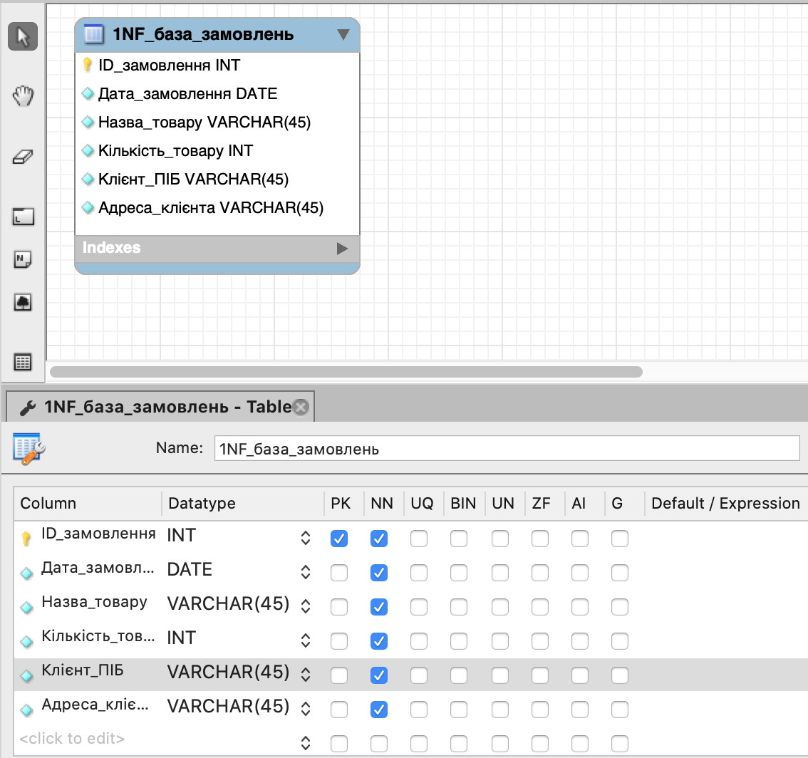
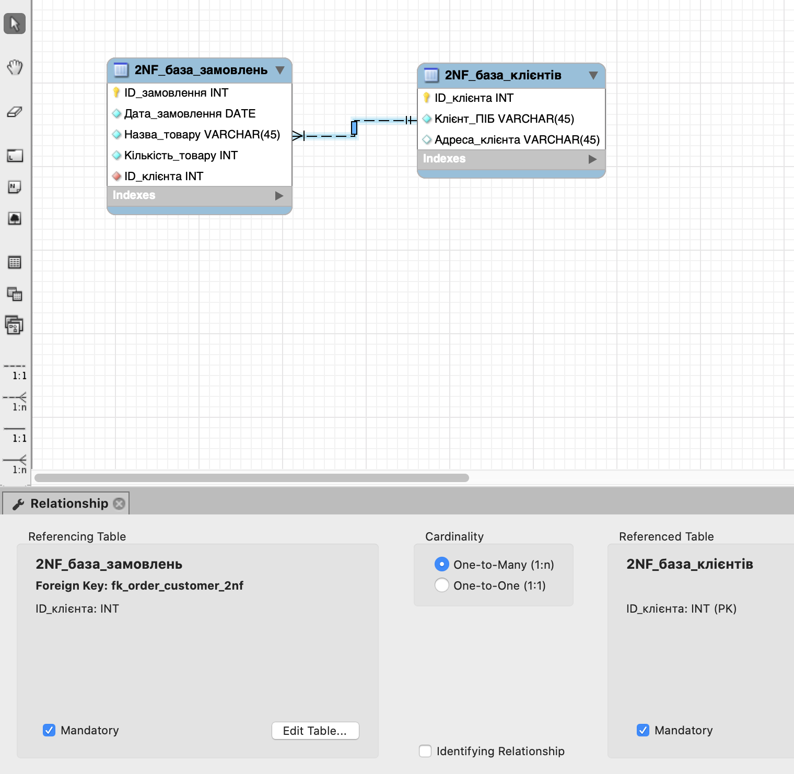
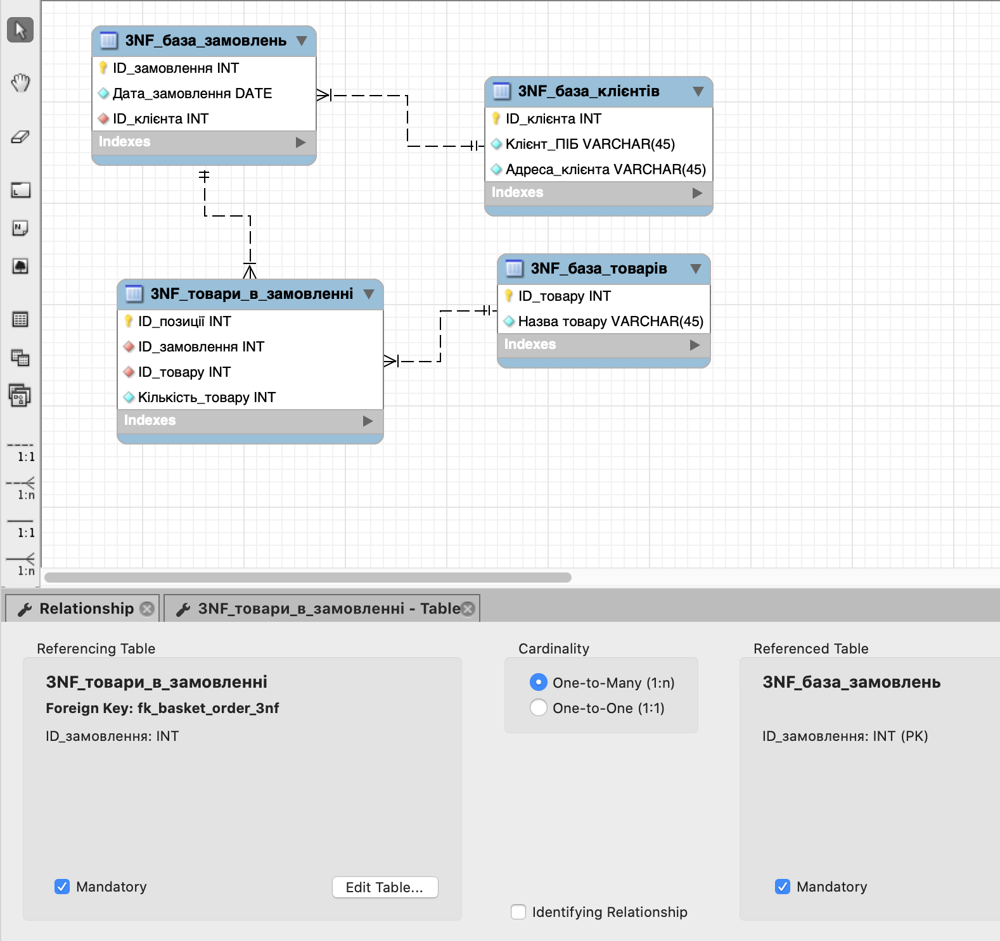
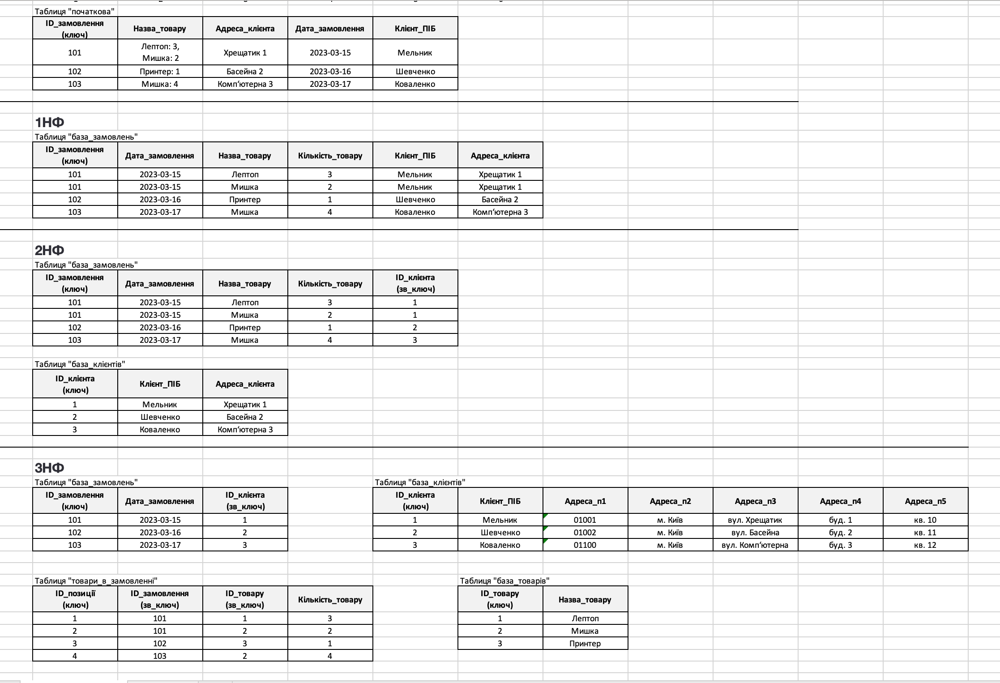
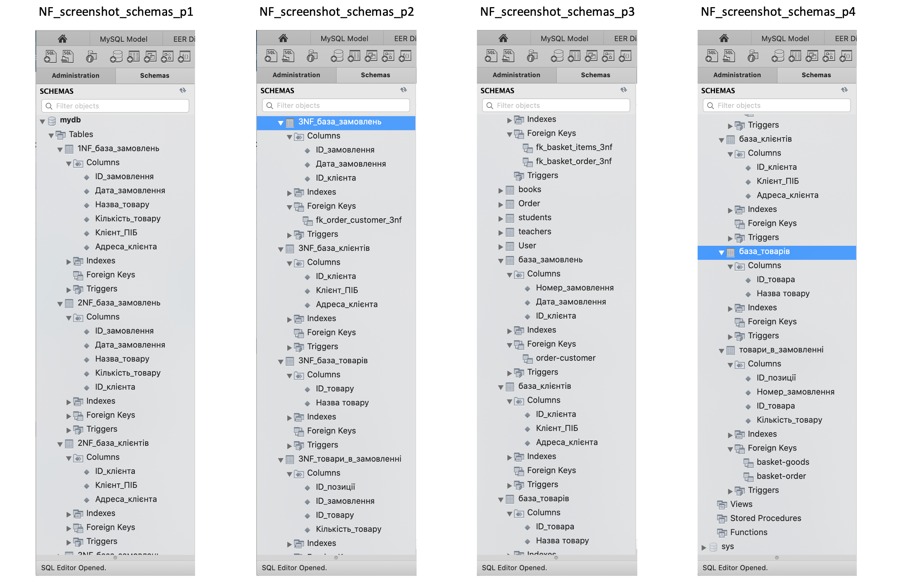

# goit-rdb-hw-02 Relationship Databases Topic II

1. Переведіть початкову таблицю в першу нормальну форму, розробіть ER-діаграму отриманих таблиць.

2. Переведіть нові таблиці в другу нормальну форму, розробіть ER-діаграму отриманих таблиць.

3. Переведіть нові таблиці в третю нормальну форму, розробіть ER-діаграму отриманих таблиць.

💡 Результат нормалізації таблиць може бути в довільній формі/форматі (Google Doc, Google таблиці тощо). 5. Створено ER-діаграму отриманих таблиць. Діаграма має відповідати нормалізованим таблицям.

💡 Має бути декілька таблиць зі зв’язком між ними. Результат може бути у вигляді файлу та/або скриншота. 6. Використано зрозумілі та конкретні імена для сутностей та атрибутів. Уточнено типи даних для атрибутів. Усі відношення й атрибути мають чіткі і зрозумілі кардинальності та значення. 7. Створено таблиці в базі даних (тільки таблиці й колонки з урахуванням зв'язків) вручну або автоматично.
💡 Результат має бути у вигляді скриншота розгорнутої схеми у Workbench.

